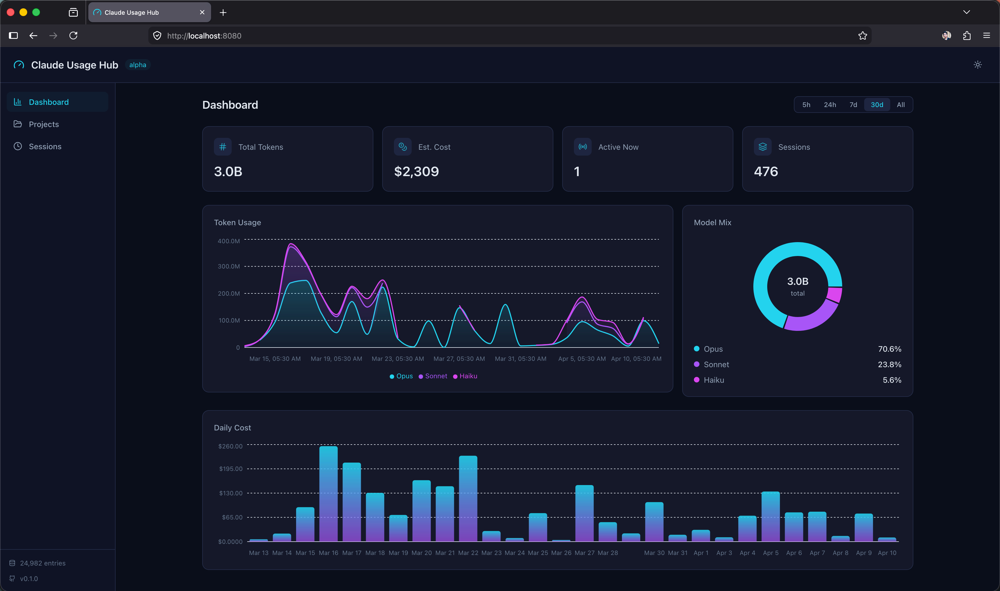

# claude-usage-hub

A lightweight, open-source tool for monitoring Claude Code token usage with a web dashboard. Track your token consumption, cost estimates, session history, and model breakdown — all from your browser.

Currently runs locally on a single machine. Team-wide monitoring across multiple developers is on the roadmap.

## Features

- **Web dashboard** - React-based UI with real-time charts and dark mode
- **Privacy-first** - Only token metrics are stored; no conversation content is ever read
- **Session tracking** - Break down usage by Claude Code session with human-readable names
- **Project tracking** - Usage grouped by project with opaque aliases for privacy
- **Model breakdown** - Track usage across Opus, Sonnet, and Haiku models
- **Cost estimation** - Based on official Anthropic API pricing (April 2026)
- **Multiple time ranges** - View 5-hour, 24-hour, 7-day, 30-day, or all-time usage
- **Auto-refresh** - Dashboard updates every 60 seconds, collector re-scans every 5 minutes
- **Dark mode** - Neon-inspired dark theme with cyan/purple/fuchsia accents
- **Lightweight** - SQLite database, single process, no external dependencies

## Screenshot



## Quick Start

```bash
# Prerequisites: Node.js >= 18, pnpm >= 9

git clone https://github.com/ARSPRodrigo/claude-usage-hub.git
cd claude-usage-hub
pnpm install
pnpm start
```

Then open [http://localhost:8080](http://localhost:8080) in your browser.

The collector automatically scans your `~/.claude/projects/` directory, ingests usage data into a local SQLite database, and serves the dashboard. The server binds to `127.0.0.1` only — it is not accessible from other devices.

### Options

```bash
# Run with custom options
pnpm build
cd packages/cli
npx tsx src/cli.ts start --port 3000        # Custom port (default: 8080)
npx tsx src/cli.ts start --interval 10      # Re-scan every 10 minutes (default: 5)
npx tsx src/cli.ts status                   # Show database and collector status
```

## Architecture

```
~/.claude/projects/**/*.jsonl
        │
        ▼
┌──────────────────┐     ┌──────────────────┐     ┌──────────────────┐
│  Collector        │────▶│  SQLite Database  │────▶│  React Dashboard │
│  Scan + Parse     │     │  (~/.claude-      │     │  localhost:8080  │
│  Dedup + Enrich   │     │   usage-hub/)     │     │                  │
└──────────────────┘     └──────────────────┘     └──────────────────┘
```

Everything runs in a single process on your machine. No network calls, no cloud, no Docker required.

## Dashboard Pages

**Dashboard** - Overview with stat cards, stacked area chart (tokens by model), donut chart (model mix), and daily cost bar chart. Supports 5h / 24h / 7d / 30d / All time ranges.

**Sessions** - Table of all Claude Code sessions with human-readable names, start time, duration, models used, token count, and cost. Paginated.

**Projects** - Usage grouped by project (aliased for privacy) with inline progress bars showing relative token consumption.

## Tech Stack

| Component | Technology |
|-----------|-----------|
| Language | TypeScript (monorepo) |
| Monorepo | pnpm workspaces + Turborepo |
| Server | Hono + @hono/node-server |
| Database | SQLite (better-sqlite3 + Drizzle ORM) |
| Frontend | React + Vite + Tailwind CSS + Recharts |
| Data fetching | TanStack Query |

## How It Works

1. **Scan** - The collector finds all `.jsonl` files in `~/.claude/projects/`, including subagent files
2. **Parse** - Streams each file from a saved byte offset (incremental reads), extracts only `type=assistant` entries
3. **Dedup** - Claude Code writes streaming entries (same ID, incrementing tokens). Only the final entry per `messageId:requestId` is kept
4. **Enrich** - Calculates cost using official Anthropic pricing, generates opaque project aliases via SHA256
5. **Store** - Inserts into SQLite with `INSERT OR IGNORE` for idempotency
6. **Serve** - Hono API serves query endpoints, React dashboard visualizes the data

## Privacy

The collector only extracts token usage metadata from Claude Code's local JSONL logs:

- Session ID, timestamp, model name
- Token counts (input, output, cache creation, cache read)
- Service tier

It **never** reads or stores:

- Conversation content (prompts or responses)
- File paths or code
- Git branches or repository names
- Working directory paths

Project directories are hashed into opaque aliases before storage. Session IDs and project aliases are displayed as human-readable generated names (e.g., `golden-harbor-drift`).

## Security

In local mode, the server binds to **`127.0.0.1` only** — it is not accessible from other devices on your network. The SQLite database file is restricted to owner-only permissions (`0600`).

**Important:** Cost estimates and usage patterns (when you work, which models, how much) should be treated as private data even though no conversation content is stored.

See [SECURITY.md](SECURITY.md) for the full security policy, data storage details, and vulnerability reporting.

## Pricing

Cost estimates are based on official Anthropic API pricing and may differ from your actual bill:

| Model | Input | Output | Cache Write (1h) | Cache Read |
|-------|-------|--------|-------------------|------------|
| Opus 4.6 | $5/MTok | $25/MTok | $10/MTok | $0.50/MTok |
| Sonnet 4.6 | $3/MTok | $15/MTok | $6/MTok | $0.30/MTok |
| Haiku 4.5 | $1/MTok | $5/MTok | $2/MTok | $0.10/MTok |

Source: [platform.claude.com/docs/en/about-claude/pricing](https://platform.claude.com/docs/en/about-claude/pricing)

## Roadmap

- [ ] Team mode: centralized server with collector agents pushing over HTTPS
- [ ] Role-based access: developers see own data, admins see org-wide
- [ ] Responsive mobile layout (with team mode)
- [ ] Docker Compose deployment for team server
- [ ] Email alerts for usage thresholds
- [ ] Data retention configuration
- [ ] Background daemon installers (launchd / systemd / Task Scheduler)
- [ ] Cross-platform collector binaries via Node SEA

## Development

```bash
# Prerequisites: Node.js >= 18, pnpm >= 9
pnpm install
pnpm build

# Run server and dashboard in dev mode (two terminals)
cd packages/server && pnpm dev          # Hono on :8080
cd packages/dashboard && pnpm dev       # Vite on :5173 (proxies /api to :8080)
```

See [CONTRIBUTING.md](CONTRIBUTING.md) for development guidelines.

## License

[MIT](LICENSE)

## Acknowledgements

Inspired by [ccusage](https://github.com/ryoppippi/ccusage) and [Claude-Code-Usage-Monitor](https://github.com/Maciek-roboblog/Claude-Code-Usage-Monitor).
