# Claude Usage Hub

A self-hosted, open-source tool for monitoring Claude Code token usage across your entire team. Track token consumption, cost breakdowns, and per-developer visibility — all from a central web dashboard.

> **v1.0.0** — Multi-org support, workspaces, role hierarchy, team leaderboard, cost comparison, and the Signal UI redesign.

## Screenshots

### Dashboard
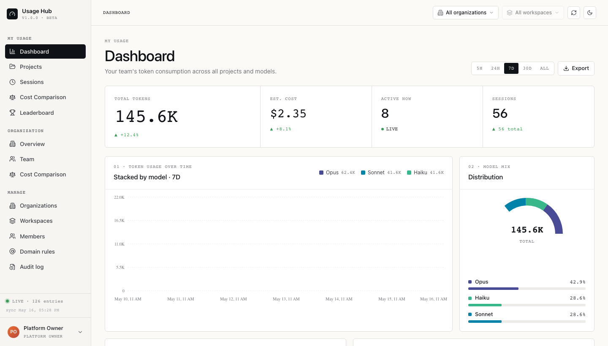
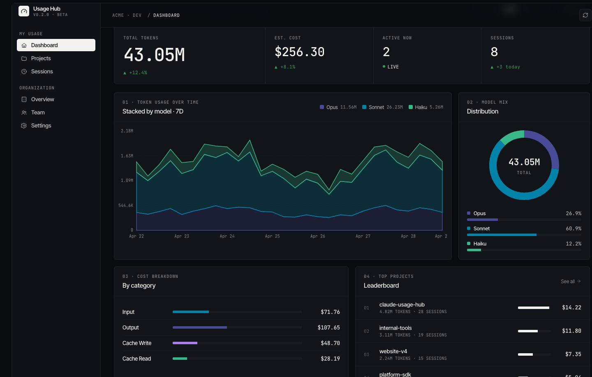

### Leaderboard
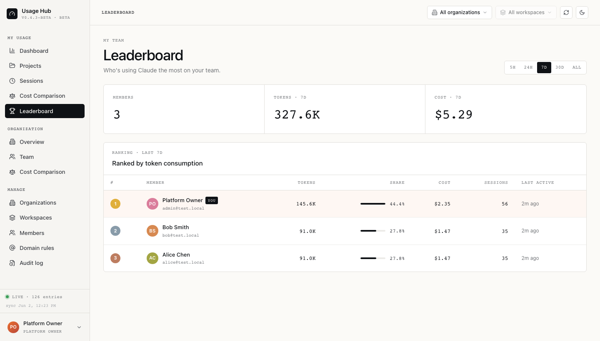
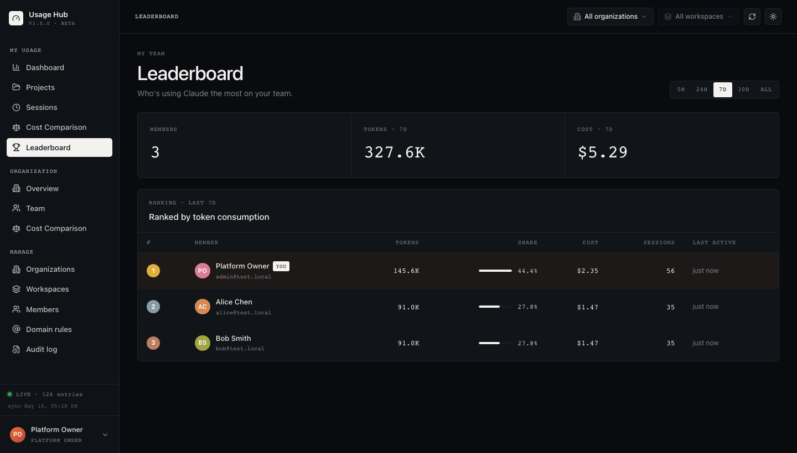

### Cost Comparison
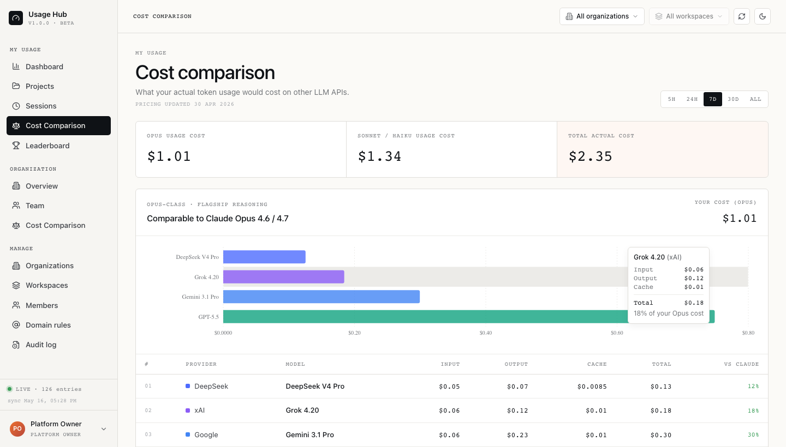
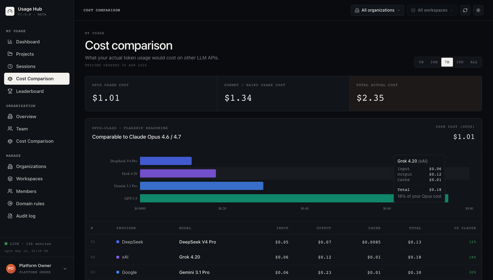

### Sessions
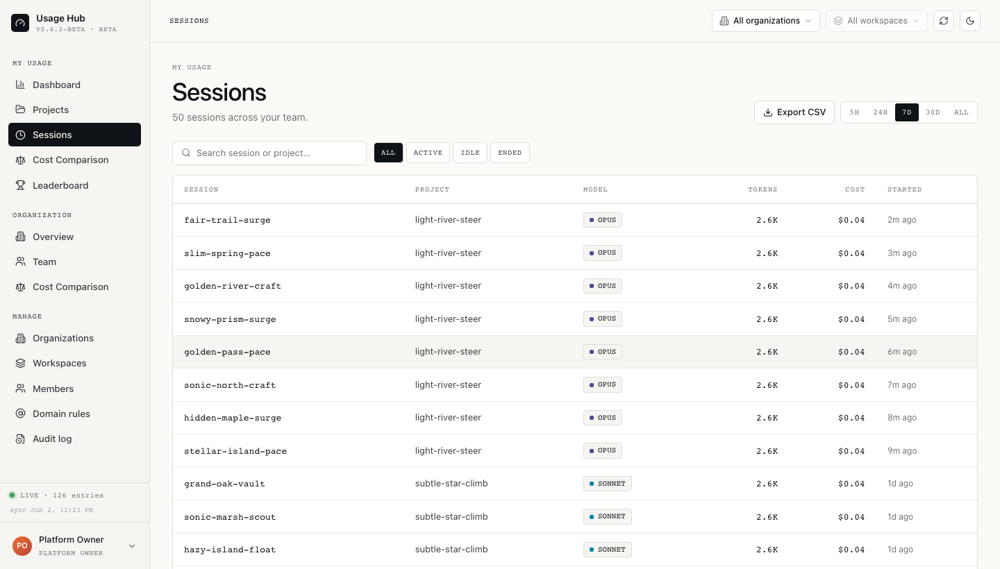

### Projects
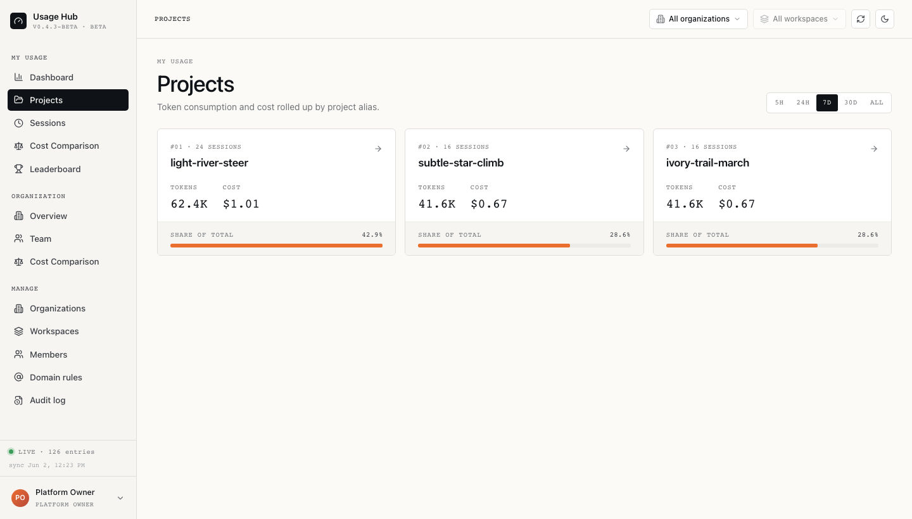

### Team Overview (Admin)
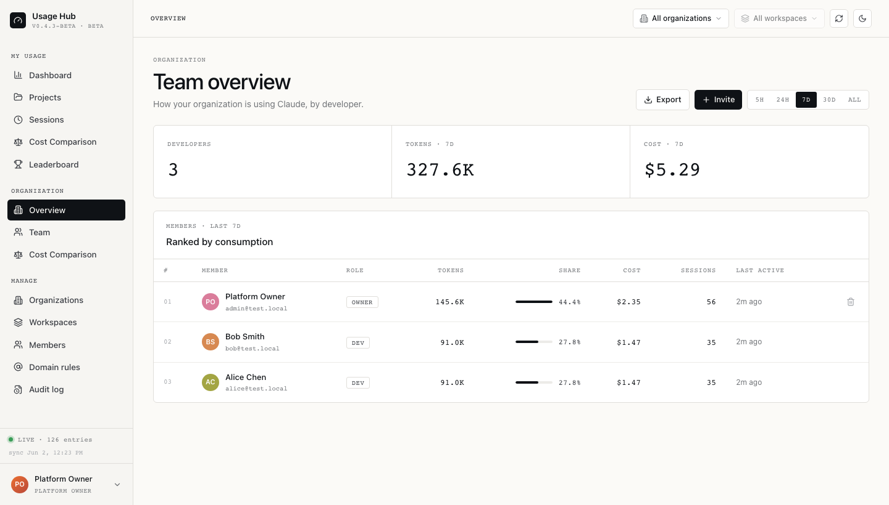

### Profile & Keys
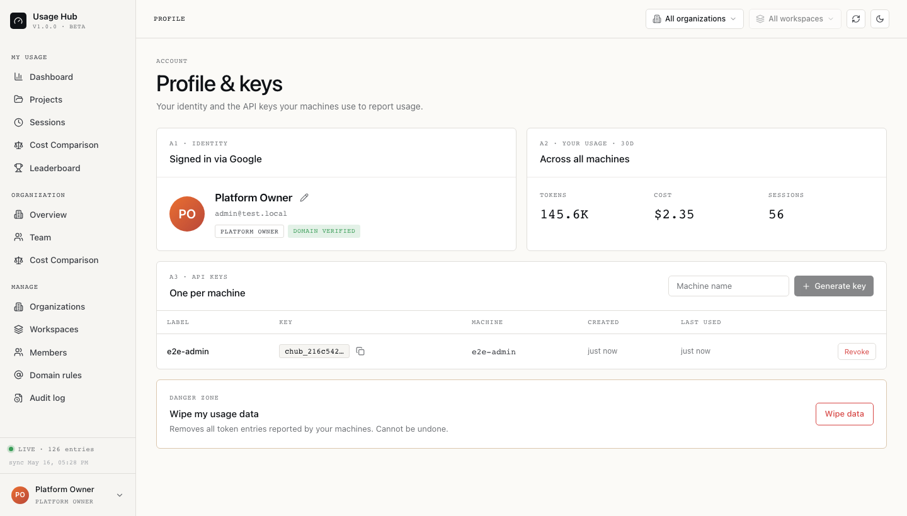

### Help & Docs
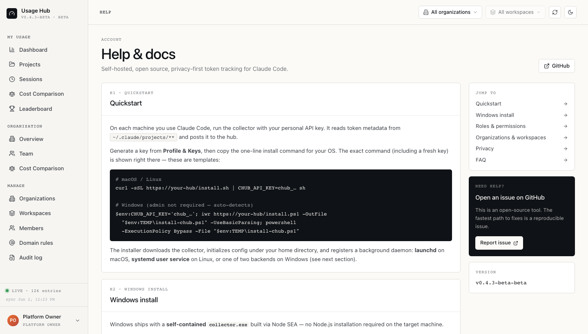

## Features

### Personal usage (all modes)
- **Token analytics** — input, output, cache creation, cache read broken down by model
- **Cost estimation** — based on official Anthropic pricing (Opus 4.6, Sonnet 4.6, Haiku 4.5)
- **Cost comparison** — see what your usage would have cost at each model tier; break-even analysis
- **Session & project tracking** — opaque aliases protect actual file paths and content
- **Multiple time ranges** — 5h / 24h / 7d / 30d / all-time
- **Dark / light mode** — follows system preference, manually toggleable
- **Privacy-first** — no conversation content is ever read or stored

### Team mode
- **Team leaderboard** — all members see each other ranked by token consumption; top 3 get gold/silver/bronze indicators; current user highlighted
- **Google OAuth** — sign-in restricted to your configured org domain
- **Password login fallback** — when Google OAuth is not configured, a username/password form is shown (useful for Docker-only setups)
- **Role-based access** — Platform Owner / Platform Admin / Developer
- **Multi-organization support** — create and manage multiple organizations with independent member lists and usage scopes
- **Workspaces** — subdivide organizations into workspaces; usage data scoped accordingly
- **Invite links** — 7-day one-time invite URLs, role assigned at invite time
- **Domain rules** — auto-assign new Google sign-ins to an org/workspace based on email domain
- **Per-developer dashboard** — owners see all members, developers see their own data
- **Per-machine tracking** — each API key tracked independently
- **Data management** — owners can wipe per-member or per-machine usage data
- **Data retention** — configurable automatic pruning
- **Audit log** — full history of role changes, invites, and admin actions

## Modes

| | Local | Team |
|---|---|---|
| Who sees data | You | Everyone (scoped by role) |
| Auth | None | Google OAuth or password |
| Collector setup | Auto (same machine) | API key per machine |
| Deployment | `pnpm start` | Docker + env vars |

## Guides

- [Local Mode Setup](docs/local-setup.md) — single developer, runs on your machine
- [Team Mode Setup](docs/team-setup.md) — centralized server, multiple developers
- [Architecture](docs/architecture.md) — how the packages fit together, data flow, auth flows
- [API Reference](docs/api-reference.md) — all endpoints, request/response shapes

## Architecture

### Local mode

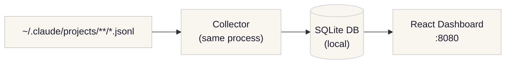
```mermaid
flowchart LR
    A["~/.claude/projects/**/*.jsonl"] --> B["Collector\n(same process)"]
    B --> C[("SQLite DB\n(local)")]
    C --> D["React Dashboard\n:8080"]

    style A fill:#f9f5ef,stroke:#ccc,color:#1a1a2e
    style B fill:#f9f5ef,stroke:#ccc,color:#1a1a2e
    style C fill:#f9f5ef,stroke:#ccc,color:#1a1a2e
    style D fill:#f9f5ef,stroke:#ccc,color:#1a1a2e
```

### Team mode

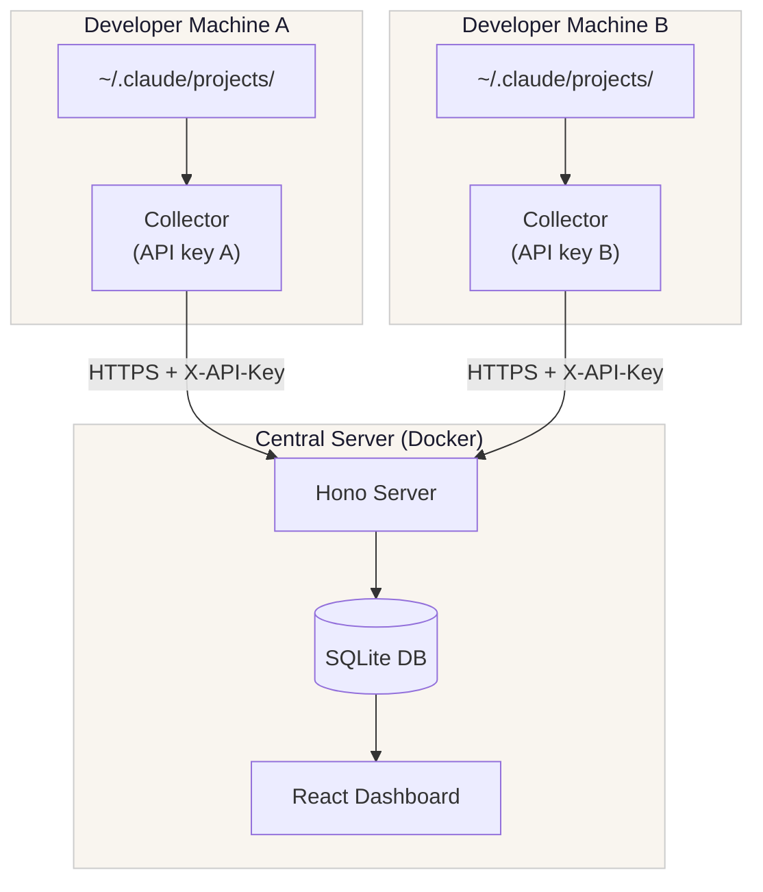
```mermaid
flowchart TB
    subgraph machineA ["Developer Machine A"]
        A1["~/.claude/projects/"] --> C1["Collector\n(API key A)"]
    end

    subgraph machineB ["Developer Machine B"]
        A2["~/.claude/projects/"] --> C2["Collector\n(API key B)"]
    end

    subgraph server ["Central Server (Docker)"]
        S1["Hono Server"]
        S2[("SQLite DB")]
        S3["React Dashboard"]
        S1 --> S2 --> S3
    end

    C1 -- "HTTPS + X-API-Key" --> S1
    C2 -- "HTTPS + X-API-Key" --> S1

    style machineA fill:#f9f5ef,stroke:#ccc,color:#1a1a2e
    style machineB fill:#f9f5ef,stroke:#ccc,color:#1a1a2e
    style server fill:#f9f5ef,stroke:#ccc,color:#1a1a2e
```

## Tech Stack

| Component | Technology |
|-----------|-----------|
| Language | TypeScript (monorepo, pnpm workspaces + Turborepo) |
| Server | Hono + @hono/node-server |
| Database | SQLite (better-sqlite3) |
| Auth | JWT (HS256) + Google Identity Services |
| Frontend | React + Vite + Tailwind CSS + Recharts + TanStack Query |
| Design | oklch color tokens, Inter Tight + JetBrains Mono |
| Deployment | Docker multi-stage build |
| Testing | Vitest (unit) + Playwright (E2E) |

## Privacy

The collector only extracts token usage metadata from Claude Code's local JSONL logs — session ID, timestamp, model, token counts, and service tier.

It **never** reads or stores:
- Conversation content (prompts or responses)
- File paths, code, or git information
- Working directory paths

Project directories are hashed into opaque aliases before storage. Session IDs are displayed as human-readable generated names (e.g., `golden-harbor-drift`).

## Security

- Local mode: server binds to `127.0.0.1` only
- Team mode: API keys stored as SHA-256 hashes; JWTs expire after 24h; Google OAuth restricted to your org domain
- SQLite database file is restricted to owner-only permissions (`0600`)

See [SECURITY.md](SECURITY.md) for the full security policy.

## Development

```bash
pnpm install
pnpm build

# Dev mode (two terminals)
cd packages/server && pnpm dev     # Hono on :8080
cd packages/dashboard && pnpm dev  # Vite on :5173 (proxies /api to :8080)

# Unit tests
pnpm test

# E2E tests (requires Docker)
pnpm e2e:build   # build image once
pnpm e2e:up      # start test environment on :8081
pnpm e2e         # run 44 Playwright tests (~30s)
pnpm e2e:down    # tear down + delete test DB

# All-in-one E2E
pnpm e2e:ci
```

## Roadmap

- [ ] Cross-platform collector binaries via Node SEA
- [ ] Email / Slack alerts for usage thresholds
- [ ] Mobile-responsive layout
- [ ] Usage budget limits per developer

## License

[MIT](LICENSE)

## Acknowledgements

Inspired by [ccusage](https://github.com/ryoppippi/ccusage) and [Claude-Code-Usage-Monitor](https://github.com/Maciek-roboblog/Claude-Code-Usage-Monitor).
